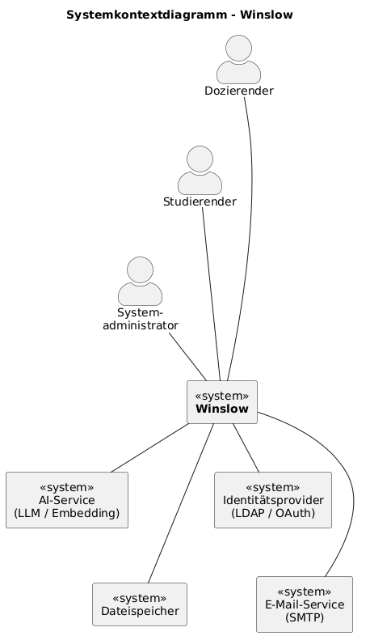
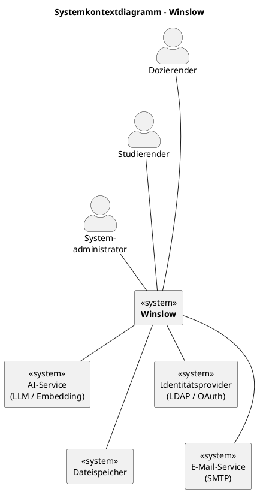

# 4. Systemkontext

## 4.1 Systemkontextdiagramm

PlantUML-Quellcode

## 4.2 Akteure

| Akteur | Typ | Beschreibung |
|---|---|---|
| **Dozierender** | Primärer Akteur | Erstellt und verwaltet Kurse und Lektionen, lädt Kursmaterialien hoch, pflegt Metadaten, prüft und gibt AI-Zusammenfassungen frei oder sperrt sie. |
| **Studierender** | Primärer Akteur | Greift auf zugewiesene Kurse und Materialien zu, nutzt die Volltextsuche, stellt kontextbezogene Fragen an die AI-Komponente, legt persönliche Notizen an. |
| **Systemadministrator** | Sekundärer Akteur | Verwaltet Benutzerkonten und Rollen, konfiguriert Zugriffsrechte und Datenschutzrichtlinien, überwacht die Systemperformance und AI-Dienste, wertet Logs aus. |

## 4.3 Fremdsysteme (Umsysteme)

| Fremdsystem | Beschreibung | Schnittstelle / Informationsfluss |
|---|---|---|
| **AI-Service (LLM / Embedding)** | Lokal betriebener AI-Dienst, der Texte zusammenfasst, Lernhilfen generiert und kontextbezogene Fragen beantwortet. | **Winslow → AI-Service:** Lektionstexte, Kursmaterialien (extrahierter Text), Nutzerfragen mit Kurskontext. **AI-Service → Winslow:** Generierte Zusammenfassungen, Lernhilfen, Antworten auf Fragen. |
| **Dateispeicher (Filesystem / Object Store)** | Persistenter Speicherort für hochgeladene Kursmaterialien (PDFs, PPTX, Skripte etc.). | **Winslow → Dateispeicher:** Hochgeladene Dateien zum Speichern. **Dateispeicher → Winslow:** Dateien zum Download/Anzeige abrufen. |
| **Identitätsprovider (LDAP / OAuth)** | Bestehendes Authentifizierungssystem der Schule, über das Benutzer sich anmelden und ihre Rolle verifiziert wird. | **Winslow → IdP:** Authentifizierungsanfrage mit Credentials. **IdP → Winslow:** Authentifizierungsbestätigung, Rollenzugehörigkeit. |
| **E-Mail-Service (SMTP)** | Dienst für den Versand von Benachrichtigungen (z.B. neue Materialien verfügbar, Zusammenfassung freigegeben). | **Winslow → E-Mail-Service:** Benachrichtigungs-E-Mails an Dozierende und Studierende. |

## 4.4 Systemgrenze – Was gehört NICHT zum System?

- Das Erstellen der originalen Lehrmaterialien selbst (geschieht in externen Programmen wie Word, PowerPoint etc.)
- Die Schulverwaltung (Einschreibung, Stundenpläne, Notenvergabe) — Winslow ist kein vollständiges SIS (Student Information System)
- Die Administration des AI-Modells (Training, Fine-Tuning) — Winslow nutzt den AI-Service als Blackbox-Fremdsystem
- Die Benutzerverwaltung der Schule im engeren Sinne — Winslow synchronisiert sich über den Identitätsprovider

---

[← Stakeholder](03_stakeholder.md) | [Zurück zur Übersicht](README.md) | [Weiter: Anforderungen →](05_anforderungen.md)
