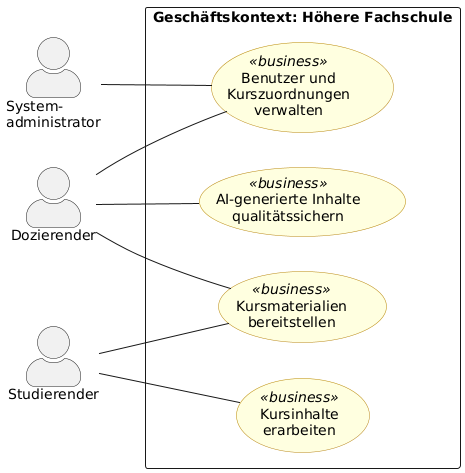
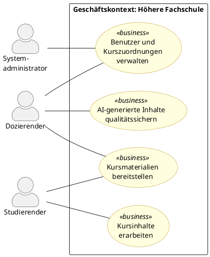
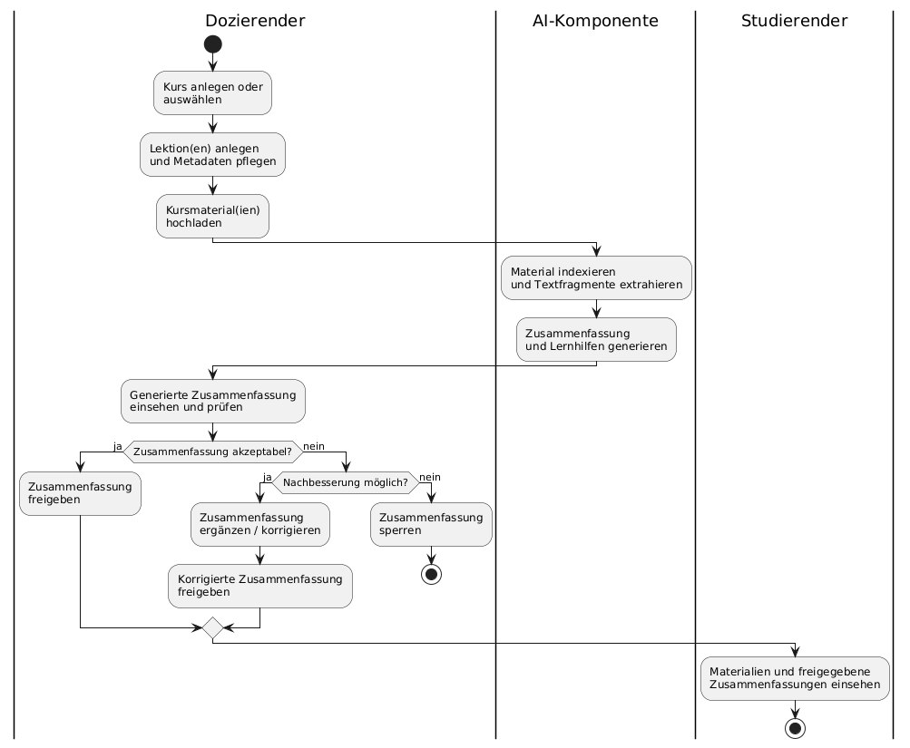
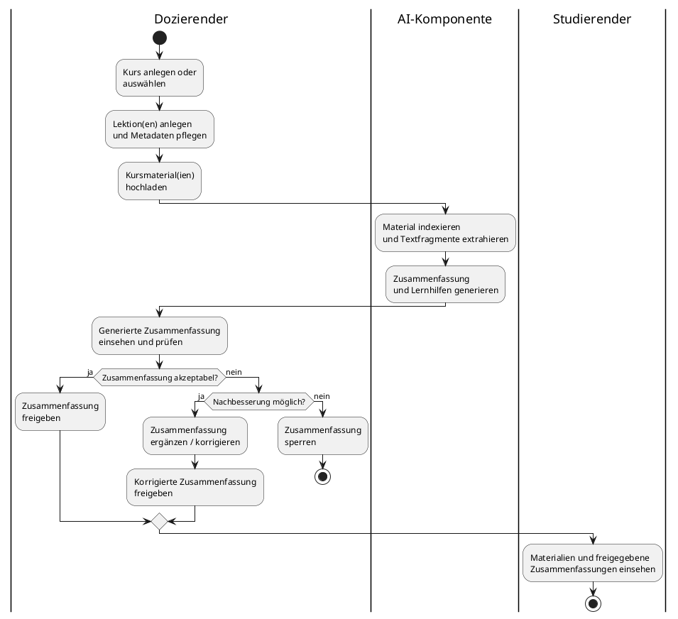

# 6. Geschäftsanwendungsfälle (Business Use Cases)

Geschäftsanwendungsfälle beschreiben die geschäftlichen Abläufe unabhängig von einer konkreten systemtechnischen Umsetzung. Sie werden aus Sicht des Geschäftsbetriebes (hier: der Höheren Fachschule) formuliert.

## 6.1 Übersicht

| BUC-ID | Name | Kurzbeschreibung | Auslöser | Ergebnis | Akteure |
|---|---|---|---|---|---|
| **BUC-01** | Kursmaterialien bereitstellen | Ein Dozierender strukturiert einen Kurs mit Lektionen, lädt Materialien hoch und pflegt Metadaten. | Dozierender bereitet eine Lehrveranstaltung vor. | Kursmaterialien sind für die eingeschriebenen Studierenden zugänglich. | Dozierender, Studierender |
| **BUC-02** | Kursinhalte erarbeiten | Ein Studierender nutzt die bereitgestellten Materialien, Zusammenfassungen und Lernhilfen. | Studierender möchte sich vorbereiten oder Stoff repetieren. | Studierender hat Inhalte eingesehen und ggf. Notizen angelegt. | Studierender |
| **BUC-03** | AI-generierte Inhalte qualitätssichern | Ein Dozierender prüft AI-Zusammenfassungen und entscheidet über Freigabe oder Sperrung. | AI-Komponente hat eine Zusammenfassung generiert. | Zusammenfassung ist freigegeben oder gesperrt. | Dozierender |
| **BUC-04** | Benutzer und Kurszuordnungen verwalten | Der Systemadministrator richtet Konten ein, weist Rollen zu und ordnet Studierende Kursen zu. | Semesterbeginn oder Änderung im Teilnehmerkreis. | Alle Benutzer haben korrekte Konten und Kurszuordnungen. | Systemadministrator, Dozierender |

## 6.2 Business Use Case Diagramm

PlantUML-Quellcode

## 6.3 Essenzbeschreibungen

### BUC-01: Kursmaterialien bereitstellen

| Feld | Beschreibung |
|---|---|
| **Name** | Kursmaterialien bereitstellen |
| **Art** | Geschäftsanwendungsfall |
| **Kurzbeschreibung** | Ein Dozierender strukturiert einen Kurs mit Lektionen, lädt die zugehörigen Materialien hoch und pflegt die Metadaten. Die AI-Komponente indexiert die Materialien und generiert Zusammenfassungen. |
| **Auslöser** | Dozierender bereitet eine Lehrveranstaltung vor oder aktualisiert bestehende Inhalte. |
| **Ergebnis** | Kursmaterialien sind strukturiert abgelegt, indexiert und für eingeschriebene Studierende zugänglich. AI-Zusammenfassungen wurden generiert. |
| **Akteure** | Dozierender, Studierender (als Empfänger) |
| **Essenzschritte** | Der Dozierende legt den Kurs und die Lektionen an. Der Dozierende lädt Materialien zu den Lektionen hoch und pflegt Metadaten. Die AI-Komponente indexiert die Materialien und generiert eine Zusammenfassung. Der Dozierende prüft die Zusammenfassung und gibt sie frei. Die Studierenden können die Materialien und freigegebenen Zusammenfassungen einsehen. |

### BUC-02: Kursinhalte erarbeiten

| Feld | Beschreibung |
|---|---|
| **Name** | Kursinhalte erarbeiten |
| **Art** | Geschäftsanwendungsfall |
| **Kurzbeschreibung** | Ein Studierender erarbeitet sich den Lernstoff, indem er Materialien einsieht, Zusammenfassungen liest, Fragen an die AI stellt und persönliche Notizen anlegt. |
| **Auslöser** | Studierender möchte sich auf eine Lektion vorbereiten, Stoff repetieren oder eine Frage klären. |
| **Ergebnis** | Studierender hat den gewünschten Stoff eingesehen, Antworten erhalten und ggf. Notizen angelegt. |
| **Akteure** | Studierender |
| **Essenzschritte** | Der Studierende wählt einen Kurs und eine Lektion aus. Der Studierende sieht Materialien und freigegebene Zusammenfassungen ein. Bei Bedarf stellt der Studierende eine Frage an die AI-Komponente. Der Studierende legt bei Bedarf persönliche Notizen an. |

## 6.4 Aktivitätsdiagramm: BUC-01 «Kursmaterialien bereitstellen»

PlantUML-Quellcode

---

[← Anforderungen](05_anforderungen.md) | [Zurück zur Übersicht](README.md) | [Weiter: Systemanwendungsfälle →](07_system_use_cases.md)
