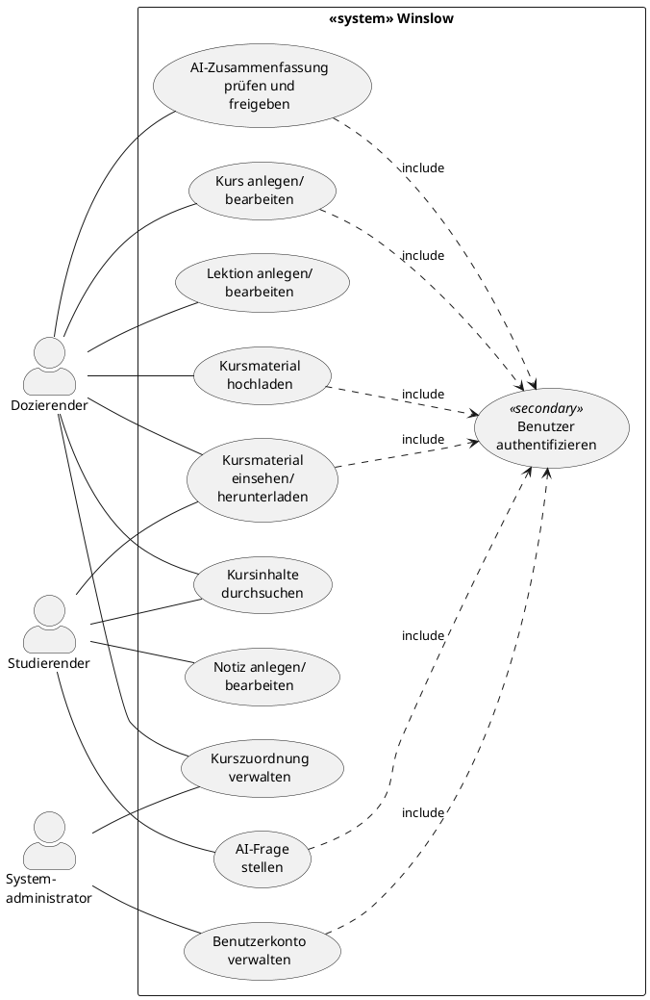

# 7. Systemanwendungsfälle (System Use Cases)

Systemanwendungsfälle beschreiben konkrete, systemtechnisch umsetzbare Abläufe aus der Sicht des primären Akteurs. Sie stellen fachliche Transaktionseinheiten dar.

## 7.1 Ableitung aus den Geschäftsanwendungsfällen

| BUC | Abgeleitete System Use Cases |
|---|---|
| BUC-01: Kursmaterialien bereitstellen | SUC-01 Kurs anlegen/bearbeiten, SUC-02 Lektion anlegen/bearbeiten, SUC-03 Kursmaterial hochladen, SUC-04 Kursmaterial einsehen/herunterladen |
| BUC-02: Kursinhalte erarbeiten | SUC-04 Kursmaterial einsehen/herunterladen, SUC-05 Kursinhalte durchsuchen, SUC-06 AI-Frage stellen, SUC-07 Notiz anlegen/bearbeiten |
| BUC-03: AI-generierte Inhalte qualitätssichern | SUC-08 AI-Zusammenfassung prüfen und freigeben |
| BUC-04: Benutzer und Kurszuordnungen verwalten | SUC-09 Benutzerkonto verwalten, SUC-10 Kurszuordnung verwalten |

Sekundärer Anwendungsfall: **SUC-S1: Benutzer authentifizieren** — wird von allen primären SUCs per «include» eingebunden.

## 7.2 System Use Case Diagramm

PlantUML-Quellcode

## 7.3 Detailbeschreibung: SUC-03 Kursmaterial hochladen

| Feld | Beschreibung |
|---|---|
| **Name** | Kursmaterial hochladen |
| **ID** | SUC-03 |
| **Kurzbeschreibung** | Ein Dozierender lädt ein oder mehrere Kursmaterialien zu einer bestehenden Lektion hoch. Das System speichert die Datei, extrahiert den Text und stösst die AI-Indexierung und Zusammenfassungsgenerierung an. |
| **Primärer Akteur** | Dozierender |
| **Auslöser** | Dozierender möchte neues Material zu einer Lektion bereitstellen. |
| **Vorbedingungen** | Dozierender ist authentifiziert (SUC-S1). Kurs und Lektion existieren bereits. |
| **Eingehende Informationen** | Datei(en) (PDF, PPTX, Skript), optionale Beschreibung |
| **Ergebnis (Nachbedingungen)** | Datei ist gespeichert und der Lektion zugeordnet. Die Kontextindexierung wurde angestossen. Eine AI-Zusammenfassung wurde generiert (Status: «Generiert»). |

**Main Success Scenario:**

| Schritt | Akteur | Aktion |
|---|---|---|
| 1 | Dozierender | Wählt einen Kurs und eine Lektion aus. |
| 2 | Dozierender | Wählt eine oder mehrere Dateien zum Upload aus und gibt optional eine Beschreibung ein. |
| 3 | System | Validiert die Dateien (erlaubte Formate, max. Dateigrösse). |
| 4 | System | Speichert die Dateien im Dateispeicher und legt die Metadaten an. |
| 5 | System | Extrahiert den Textinhalt und übergibt ihn an die AI-Komponente zur Kontextindexierung. |
| 6 | System | AI-Komponente generiert eine Zusammenfassung (Status: «Generiert»). |
| 7 | System | Zeigt dem Dozierenden eine Bestätigung an. |

**Alternativ- und Ausnahmeflüsse:**

| ID | Bedingung | Beschreibung |
|---|---|---|
| 3a | Ungültiges Dateiformat | System weist die Datei ab und zeigt erlaubte Formate an. Zurück zu Schritt 2. |
| 3b | Dateigrösse überschritten | System weist die Datei ab und zeigt die maximale Grösse an. Zurück zu Schritt 2. |
| 5a | Textextraktion fehlgeschlagen | System speichert die Datei, markiert sie als «nicht indexiert» und informiert den Dozierenden. |
| 6a | AI-Service nicht erreichbar | System speichert Datei und Texte. Zusammenfassung wird in Warteschlange eingereiht. |
| * | Abbruch durch Dozierenden | Keine Änderungen werden gespeichert. |

## 7.4 Detailbeschreibung: SUC-06 AI-Frage stellen

| Feld | Beschreibung |
|---|---|
| **Name** | AI-Frage stellen |
| **ID** | SUC-06 |
| **Kurzbeschreibung** | Ein Studierender stellt innerhalb eines Kurses eine Frage an die AI-Komponente. Das System übergibt die Frage mit Kurskontext an den AI-Service und zeigt die Antwort inkl. Quellverweisen an. |
| **Primärer Akteur** | Studierender |
| **Auslöser** | Studierender möchte eine inhaltliche Frage zu einem Kurs klären. |
| **Vorbedingungen** | Studierender ist authentifiziert (SUC-S1). Studierender ist dem Kurs zugeordnet. Es existieren indexierte Kursmaterialien. |
| **Eingehende Informationen** | Freitextfrage, aktueller Kurskontext (Kurs-ID) |
| **Ergebnis (Nachbedingungen)** | Studierender hat eine kontextbezogene Antwort mit Quellverweisen erhalten. Die Anfrage wurde im Audit-Log protokolliert. |

**Main Success Scenario:**

| Schritt | Akteur | Aktion |
|---|---|---|
| 1 | Studierender | Navigiert zu einem Kurs und öffnet die AI-Q&A-Funktion. |
| 2 | Studierender | Gibt eine Frage ein und sendet sie ab. |
| 3 | System | Validiert die Eingabe (nicht leer, max. Zeichenlänge). |
| 4 | System | Ermittelt den Kurskontext und übergibt Frage + Kontext an den AI-Service. |
| 5 | System | AI-Service generiert eine Antwort auf Basis des Kurskontexts. |
| 6 | System | Zeigt die Antwort mit Quellverweisen an. |
| 7 | System | Protokolliert die Anfrage im Audit-Log. |

**Alternativ- und Ausnahmeflüsse:**

| ID | Bedingung | Beschreibung |
|---|---|---|
| 3a | Leere oder zu lange Eingabe | System zeigt Validierungsfehler. Zurück zu Schritt 2. |
| 4a | Keine indexierten Materialien | System informiert, dass kein Material indexiert ist. Anwendungsfall endet. |
| 5a | AI-Service nicht erreichbar | System zeigt Fehlermeldung und empfiehlt späteres Versuchen. |
| 5b | Geringe Konfidenz | System zeigt Antwort mit Hinweis und verweist auf Volltextsuche. |
| * | Abbruch durch Studierenden | Keine Aktion wird gespeichert. |

---

[← Geschäftsanwendungsfälle](06_business_use_cases.md) | [Zurück zur Übersicht](README.md) | [Weiter: Dynamische Modellierung →](08_dynamische_modellierung.md)
