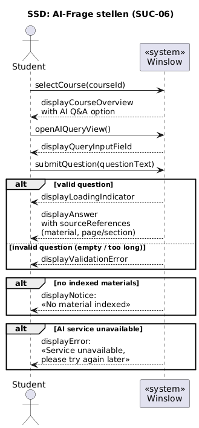
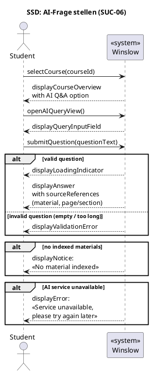
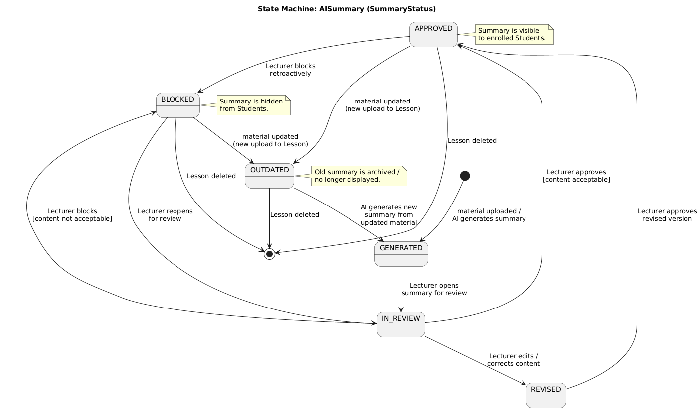
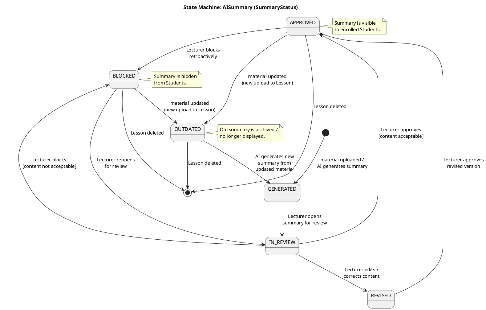

# 8. Dynamische Modellierung

## 8.1 Systemsequenzdiagramm (SSD): SUC-06 «AI-Frage stellen»

Das Systemsequenzdiagramm zeigt die Interaktion zwischen dem Akteur und dem System als Blackbox. Interne Abläufe sind nicht sichtbar.

PlantUML-Quellcode

## 8.2 Zustandsdiagramm: Lebenszyklus einer «AI-Zusammenfassung»

Die AI-Zusammenfassung ist ein zentrales Geschäftsobjekt mit einem komplexen Lebenszyklus.

PlantUML-Quellcode

## Erläuterung der Zustände

| State (SummaryStatus) | Zustand (DE) | Beschreibung |
|---|---|---|
| **GENERATED** | Generiert | Die AI-Komponente hat eine Zusammenfassung erzeugt. Sie ist noch nicht geprüft und für Studierende nicht sichtbar. |
| **IN_REVIEW** | In Prüfung | Ein Dozierender hat die Zusammenfassung geöffnet und prüft den Inhalt. |
| **REVISED** | Überarbeitet | Der Dozierende hat die Zusammenfassung manuell ergänzt oder korrigiert. Sie wartet auf die finale Freigabe. |
| **APPROVED** | Freigegeben | Die Zusammenfassung ist geprüft und für alle eingeschriebenen Studierenden sichtbar. |
| **BLOCKED** | Gesperrt | Die Zusammenfassung wurde als ungeeignet markiert und ist für Studierende nicht sichtbar. |
| **OUTDATED** | Veraltet | Das zugrundeliegende Kursmaterial wurde aktualisiert. Die alte Zusammenfassung wird archiviert und eine Neugenerierung angestossen. |

---

[← Systemanwendungsfälle](07_systemanwendungsfaelle.md) | [Zurück zur Übersicht](README.md) | [Weiter: Fachklassendiagramm →](09_fachklassendiagramm.md)
