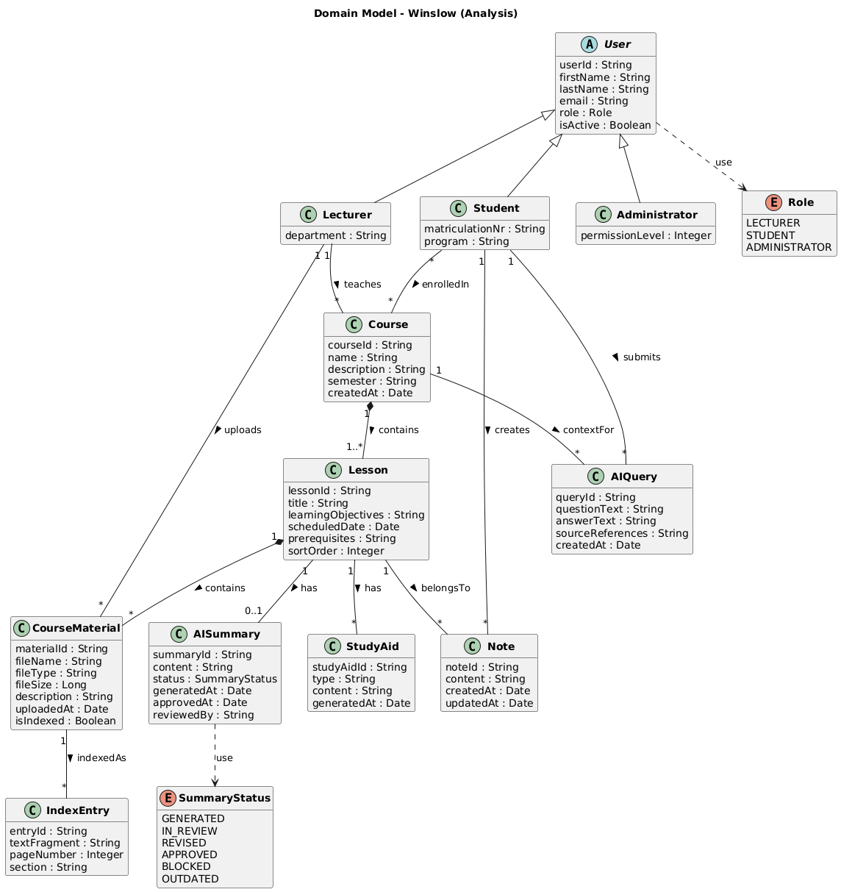
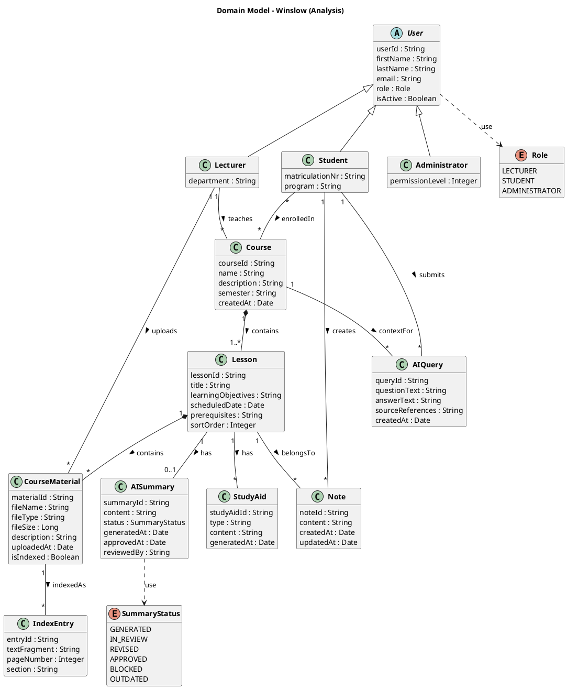

# 9. Fachklassendiagramm (Domain Model)

Das Fachklassenmodell beschreibt die wichtigsten fachlichen Gegenstände und ihre strukturellen Zusammenhänge. In der Analysephase werden Klassen mit ihren fachlich motivierten Attributen modelliert — ohne Operationen/Methoden.

> **Konvention:** Klassennamen, Attribute, Enum-Werte und Assoziationsrollen sind in Englisch gehalten (Industriestandard). Die fachlichen Beschreibungen bleiben auf Deutsch.

## 9.1 Identifizierte Fachklassen

| Fachklasse (EN) | Fachbegriff (DE) | Beschreibung |
|---|---|---|
| **User** | Benutzer | Abstrakte Oberklasse für alle Personen im System. Enthält gemeinsame Attribute wie Name und E-Mail. |
| **Lecturer** | Dozierender | Spezialisierung von User. Erstellt und verwaltet Kurse. |
| **Student** | Studierender | Spezialisierung von User. Ist Kursen zugeordnet und nutzt Materialien. |
| **Administrator** | Administrator | Spezialisierung von User. Verwaltet Konten und Systemkonfiguration. |
| **Course** | Kurs | Eine thematisch zusammengehörende Lehrveranstaltung mit Metadaten. |
| **Lesson** | Lektion | Eine einzelne Unterrichtseinheit innerhalb eines Kurses. |
| **CourseMaterial** | Kursmaterial | Ein hochgeladenes Dokument, das einer Lesson zugeordnet ist. |
| **AISummary** | AI-Zusammenfassung | Automatisch generierte Zusammenfassung einer Lesson mit Review-/Approval-Status. |
| **StudyAid** | Lernhilfe | Automatisch generierte, ergänzende Lerninhalte zu einer Lesson. |
| **Note** | Notiz | Persönliche Textanmerkung eines Student zu einer Lesson. |
| **AIQuery** | AI-Anfrage | Eine kontextbezogene Frage eines Student inkl. generierter Antwort. |
| **IndexEntry** | Indexeintrag | Ein Textfragment aus einem CourseMaterial, das im Search Index abgelegt ist. |

## 9.2 Fachklassendiagramm

PlantUML-Quellcode

## 9.3 Erläuterung der wichtigsten Beziehungen

**Vererbung (Inheritance):** Lecturer, Student und Administrator sind Spezialisierungen von User. Die gemeinsamen Attribute (firstName, lastName, email, role) werden in der Oberklasse gehalten.

**Kompositionen (Composition):** Course *contains* 1..* Lessons — ohne Course existieren keine Lessons. Lesson *contains* * CourseMaterials — ohne Lesson existiert kein zugeordnetes Material.

**Assoziationen mit Multiplizitäten:** Ein Lecturer *teaches* beliebig viele Courses (1 → \*). Students sind in beliebig viele Courses *enrolledIn* (\* → \*). Jede Lesson *has* maximal eine aktive AISummary (1 → 0..1). Jedes CourseMaterial wird zu beliebig vielen IndexEntries *indexedAs* (1 → \*). Jede Note gehört genau einem Student (*creates*) und bezieht sich auf genau eine Lesson (*belongsTo*). Jede AIQuery wird von einem Student *submitted* und referenziert einen Course als Kontext (*contextFor*).

**Enumerationen:** Role und SummaryStatus sind als Enums modelliert. Der SummaryStatus bildet exakt die Zustände aus dem [Zustandsdiagramm](08_dynamische_modellierung.md#82-zustandsdiagramm-lebenszyklus-einer-ai-zusammenfassung) ab.

### Mapping: Enum-Werte ↔ Zustandsdiagramm

| SummaryStatus | Zustand (DE) | Beschreibung |
|---|---|---|
| `GENERATED` | Generiert | AI hat Zusammenfassung erzeugt, noch nicht geprüft. |
| `IN_REVIEW` | In Prüfung | Dozierender prüft den Inhalt. |
| `REVISED` | Überarbeitet | Dozierender hat manuell ergänzt/korrigiert. |
| `APPROVED` | Freigegeben | Für Studierende sichtbar. |
| `BLOCKED` | Gesperrt | Für Studierende nicht sichtbar. |
| `OUTDATED` | Veraltet | Material wurde aktualisiert, Neugenerierung angestossen. |

---

[← Dynamische Modellierung](08_dynamische_modellierung.md) | [Zurück zur Übersicht](README.md)
